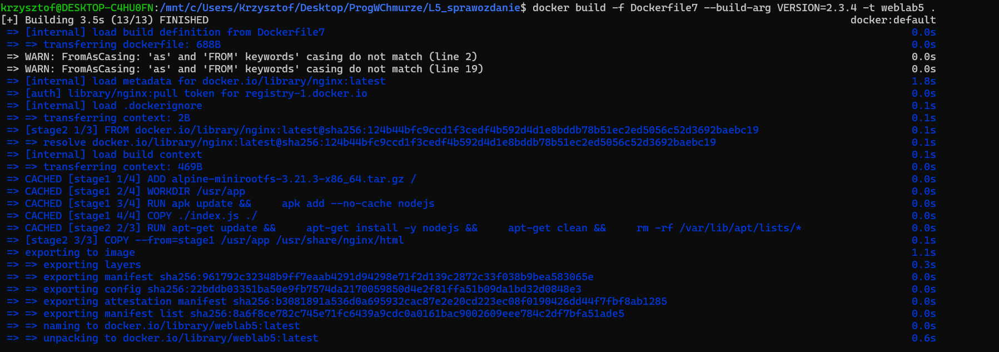
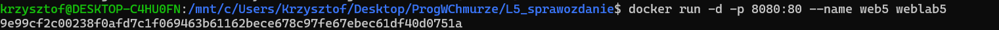
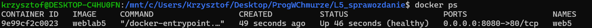
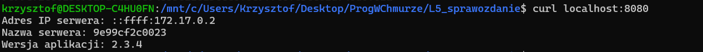

# SPRAWOZDANIE LAB5
## 1. Polecenie użyte do budowy obrazu
```shell 
docker build -f Dockerfile7 --build-arg VERSION=2.3.4 -t weblab5 .
```
Wynik działania polecenia


## 2. Polecenie uruchamiające serwer
```shell
docker run -d -p 8080:80 --name web5 weblab5
```
Wynik działania polecenia


## 3. Polecenie potwierdzające działanie kontenera
```shell
docker ps
```
Wynik działania polecenia


## 4. Polecenie potwierdzające, że aplikacja realizuje wymaganą funkcjonalność
```shell
curl localhost:8080
```
Wynik działania polecenia

